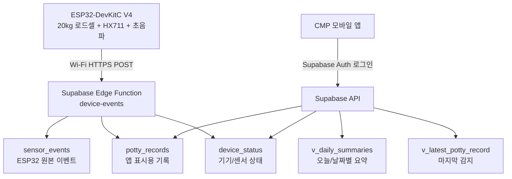

# 멍끄적 Supabase 설계 문서
---

## 1. 최종 아키텍처



## 2. 화면별 필요한 데이터

## 2.1 기기 연결 화면

화면 예시에는 다음 항목이 있다.

```text
기기 연결
Arduino 키트 연결
연결 체크
- 패드 아래 센서들이 정상인가요?
- 패드 추가 기구물 자동 보정됐나요?
- 무게를 수평 모드로 시작해요
기기 연결하기
```

보드는 ESP32를 사용하므로 앱 문구는 `Arduino 키트 연결`보다 `ESP32 기기 연결` 또는 `기기 연결`을 권장한다.

| UI 요소 | Supabase 데이터 |
|---|---|
| 기기 이름 | `devices.display_name` |
| 연결 상태 | `device_status.connection_state` |
| 로드셀 정상 여부 | `device_status.loadcell_ok` |
| 초음파 정상 여부 | `device_status.ultrasonic_ok` |
| 보정 완료 여부 | `device_status.calibrated_at is not null` |
| 현재 무게/거리 디버그 | `device_status.current_weight_g`, `device_status.current_distance_cm` |

---

## 2.2 홈 화면

화면 예시에는 다음 항목이 있다.

```text
오늘 상태
마지막 감지 14분 전
소변 4회
대변 1회
```

패드 포화도는 제외한다.

| UI 요소 | Supabase 데이터 |
|---|---|
| 마지막 감지 | `v_latest_potty_record.occurred_at` |
| 오늘 소변 횟수 | `v_daily_summaries.urine_count` |
| 오늘 대변 횟수 | `v_daily_summaries.feces_count` |
| 오늘 방문 횟수, 필요 시 | `v_daily_summaries.visit_count` |
| 기기 온라인 여부 | `device_status.connection_state` |

---

## 2.3 배변 기록 화면

화면 예시에는 다음 항목이 있다.

```text
배변 기록
오늘 2026.06.04
15:22 소변
12:10 패드 방문
09:10 대변
```

| UI 요소 | Supabase 데이터 |
|---|---|
| 날짜별 타임라인 | `potty_records` 날짜 필터 |
| 표시 순서 | `potty_records.occurred_at desc` |
| 소변 | `potty_records.record_type = 'URINE'` |
| 대변 | `potty_records.record_type = 'FECES'` |
| 패드 방문 | `potty_records.record_type = 'VISIT'` |

---

## 3. 데이터 설계 요약

초보자용으로 먼저 한 문장씩 정리하면 다음과 같다.

| 테이블 | 쉽게 말하면 | 앱에서 직접 사용? |
|---|---|---|
| `profiles` | 로그인한 사용자 정보 | 거의 사용 안 함 |
| `pets` | 강아지 정보 | 사용 |
| `devices` | ESP32 기기 정보 | 사용 |
| `device_status` | 기기 연결/센서 상태 | 사용 |
| `device_settings` | LED 경고와 센서 임계값 설정 | 사용 |
| `sensor_events` | ESP32가 보낸 원본 센서 이벤트 | 디버그용 |
| `potty_records` | 앱 화면에 보여줄 배변 기록 | 가장 중요 |
| `record_edit_logs` | 기록 이력 | 현재 UI 미사용 |

핵심은 `potty_records`다. 앱의 홈 화면과 배변 기록 화면은 대부분 이 테이블 또는 이 테이블을 기반으로 만든 view를 읽는다.

---

## 4. 이벤트와 기록 타입 규칙

## 4.1 ESP32 이벤트 타입

ESP32가 Edge Function으로 보내는 이벤트 이름이다.

| eventType | 의미 | 앱 기록 생성 여부 |
|---|---|---|
| `DEVICE_READY` | ESP32 부팅 완료 | X |
| `HEARTBEAT` | ESP32 살아 있음 | X |
| `CALIBRATION_DONE` | 센서 보정 완료 | X |
| `VISIT_START` | 강아지 패드 방문 시작 | O, `VISIT` 생성 |
| `VISIT_END` | 강아지 패드 방문 종료 | O, 기존 `VISIT` duration 갱신 |
| `URINE_DETECTED` | 소변 감지 | O, `URINE` 생성 |
| `FECES_DETECTED` | 대변 감지 | O, `FECES` 생성 |
| `UNKNOWN` | 분류되지 않은 원본 이벤트 | O, `potty_records` 생성 없음 |
| `NO_WASTE_DETECTED` | 방문했지만 배변 없음 | X, 방문 기록만 유지 |
| `SENSOR_ERROR` | 센서 오류 | X, 상태만 갱신 |

## 4.2 앱 기록 타입

앱 화면에 표시되는 타입이다.

| record_type | 앱 문구 | 카운트 규칙 |
|---|---|---|
| `VISIT` | 패드 방문 | 방문 +1 |
| `URINE` | 소변 | 소변 +1 |
| `FECES` | 대변 | 대변 +1 |
| `MIXED` | 소변+대변 | 소변 +1, 대변 +1 둘 다 반영 |

---

## 5. ESP32 → Supabase API 계약

ESP32는 DB 테이블에 직접 쓰지 않고 Edge Function으로 보낸다.

### Endpoint

```http
POST https://<project-ref>.supabase.co/functions/v1/device-events
Content-Type: application/json
x-device-code: pad-001
x-device-key: <device-secret>
x-firmware-version: 0.1.0
```

`x-device-key`는 Supabase service role key가 아니다. ESP32 기기별로 따로 발급한 비밀키다.

### 요청 예시: 소변 감지

```json
{
  "schemaVersion": 1,
  "deviceCode": "pad-001",
  "seq": 103,
  "eventType": "URINE_DETECTED",
  "visitSeq": 12,
  "deviceMillis": 407000,
  "occurredAt": "2026-06-04T03:10:26.000Z",
  "classification": "URINE",
  "confidence": "HIGH",
  "sensor": {
    "preVisitPadWeightG": 0.0,
    "postVisitPadWeightG": 32.5,
    "residualDeltaG": 32.5,
    "distanceCm": 18.3,
    "heightDeltaCm": 0.1
  }
}
```

### 응답 예시: 저장 성공

```json
{
  "ok": true,
  "duplicate": false,
  "eventId": "1e2c2c8d-9b32-4dd6-bf21-b3f6c915b888",
  "serverReceivedAt": "2026-06-04T03:10:27.120Z"
}
```

### 응답 예시: 중복 이벤트

```json
{
  "ok": true,
  "duplicate": true,
  "eventId": "1e2c2c8d-9b32-4dd6-bf21-b3f6c915b888"
}
```

ESP32는 Wi‑Fi가 끊기면 같은 이벤트를 다시 보낼 수 있다. 그래서 `device_id + seq`를 unique로 잡고, 중복이면 실패가 아니라 성공으로 처리한다.

---

## 6. SQL 스키마

아래 SQL은 Supabase SQL Editor에 넣어 실행할 수 있는 초안이다.

## 6.1 Enum 타입

```sql
create extension if not exists pgcrypto;

create type public.connection_state as enum (
    'SETUP_REQUIRED',
    'ONLINE',
    'OFFLINE',
    'ERROR'
);

create type public.sensor_event_type as enum (
    'DEVICE_READY',
    'HEARTBEAT',
    'CALIBRATION_DONE',
    'VISIT_START',
    'VISIT_END',
    'URINE_DETECTED',
    'FECES_DETECTED',
    'UNKNOWN',
    'NO_WASTE_DETECTED',
    'SENSOR_ERROR'
);

create type public.potty_record_type as enum (
    'VISIT',
    'URINE',
    'FECES',
    'MIXED'
);

create type public.record_source as enum (
    'DEVICE_AUTO'
);

create type public.confidence_level as enum (
    'HIGH',
    'MEDIUM',
    'LOW',
    'USER_CONFIRMED'
);
```

---

## 6.2 사용자와 반려견

```sql
create table public.profiles (
    id uuid primary key references auth.users(id) on delete cascade,
    nickname text,
    created_at timestamptz not null default now(),
    updated_at timestamptz not null default now()
);

create table public.pets (
    id uuid primary key default gen_random_uuid(),
    owner_id uuid not null references public.profiles(id) on delete cascade,
    name text not null default '내 강아지',
    birth_date date,
    weight_g numeric,
    created_at timestamptz not null default now(),
    updated_at timestamptz not null default now()
);
```

---

## 6.3 기기 정보

```sql
create table public.devices (
    id uuid primary key default gen_random_uuid(),
    owner_id uuid references public.profiles(id) on delete set null,
    pet_id uuid references public.pets(id) on delete set null,

    device_code text not null unique,
    display_name text not null default 'ESP32 배변 감지기',
    firmware_version text,

    -- 실제 운영에서는 원문 secret이 아니라 hash를 저장한다.
    device_secret_hash text not null,

    claimed_at timestamptz,
    last_seen_at timestamptz,
    created_at timestamptz not null default now(),
    updated_at timestamptz not null default now()
);
```

---

## 6.4 기기 상태와 설정

```sql
create table public.device_status (
    device_id uuid primary key references public.devices(id) on delete cascade,

    connection_state public.connection_state not null default 'SETUP_REQUIRED',

    loadcell_ok boolean not null default false,
    ultrasonic_ok boolean not null default false,
    calibrated_at timestamptz,

    current_weight_g numeric,
    current_distance_cm numeric,
    rssi integer,
    ip_address inet,

    last_error text,
    updated_at timestamptz not null default now()
);

create table public.device_settings (
    device_id uuid primary key references public.devices(id) on delete cascade,

    led_alert_enabled boolean not null default true,

    visit_threshold_g numeric not null default 500,
    urine_delta_g numeric not null default 25,
    feces_delta_g numeric not null default 15,
    feces_height_delta_cm numeric not null default 2.0,

    timezone text not null default 'Asia/Seoul',

    created_at timestamptz not null default now(),
    updated_at timestamptz not null default now()
);
```

---

## 6.5 ESP32 원본 이벤트

```sql
create table public.sensor_events (
    id uuid primary key default gen_random_uuid(),

    device_id uuid not null references public.devices(id) on delete cascade,

    seq integer not null,
    schema_version integer not null default 1,

    event_type public.sensor_event_type not null,
    visit_seq integer,

    occurred_at timestamptz,
    received_at timestamptz not null default now(),
    device_millis bigint,

    weight_g numeric,
    dog_weight_estimate_g numeric,
    pre_visit_pad_weight_g numeric,
    post_visit_pad_weight_g numeric,
    residual_delta_g numeric,
    distance_cm numeric,
    height_delta_cm numeric,

    confidence public.confidence_level,
    raw_payload jsonb not null,

    created_at timestamptz not null default now(),

    constraint sensor_events_device_seq_unique unique (device_id, seq)
);

create index sensor_events_device_time_idx
on public.sensor_events(device_id, coalesce(occurred_at, received_at) desc);
```

---

## 6.6 앱 표시용 배변 기록

```sql
create table public.potty_records (
    id uuid primary key default gen_random_uuid(),

    owner_id uuid not null references public.profiles(id) on delete cascade,
    pet_id uuid references public.pets(id) on delete set null,
    device_id uuid references public.devices(id) on delete set null,
    sensor_event_id uuid references public.sensor_events(id) on delete set null,

    -- 같은 방문을 연결하기 위한 ESP32 방문 번호
    visit_seq integer,

    record_type public.potty_record_type not null,
    source public.record_source not null default 'DEVICE_AUTO',

    occurred_at timestamptz not null,
    duration_ms bigint,

    weight_g numeric,
    dog_weight_estimate_g numeric,
    residual_delta_g numeric,
    distance_cm numeric,
    height_delta_cm numeric,

    confidence public.confidence_level,
    note text,

    is_edited boolean not null default false,
    deleted_at timestamptz,

    created_by uuid references public.profiles(id) on delete set null,
    updated_by uuid references public.profiles(id) on delete set null,

    created_at timestamptz not null default now(),
    updated_at timestamptz not null default now()
);

create index potty_records_owner_time_idx
on public.potty_records(owner_id, occurred_at desc)
where deleted_at is null;

create index potty_records_device_time_idx
on public.potty_records(device_id, occurred_at desc)
where deleted_at is null;

create index potty_records_device_visit_idx
on public.potty_records(device_id, visit_seq)
where deleted_at is null;
```

---

## 6.7 기록 수정 로그

```sql
create table public.record_edit_logs (
    id uuid primary key default gen_random_uuid(),

    record_id uuid not null references public.potty_records(id) on delete cascade,
    edited_by uuid not null references public.profiles(id) on delete cascade,

    before_data jsonb not null,
    after_data jsonb not null,

    created_at timestamptz not null default now()
);
```

---

## 7. 앱 조회용 View

## 7.1 날짜별 요약 View

홈의 `소변 4회`, `대변 1회`, 기록 화면의 날짜별 요약에 사용한다.

```sql
create view public.v_daily_summaries
with (security_invoker = true)
as
select
    pr.owner_id,
    pr.pet_id,
    pr.device_id,
    (pr.occurred_at at time zone 'Asia/Seoul')::date as record_date,

    count(*) filter (where pr.record_type = 'VISIT') as visit_count,

    count(*) filter (
        where pr.record_type in ('URINE', 'MIXED')
    ) as urine_count,

    count(*) filter (
        where pr.record_type in ('FECES', 'MIXED')
    ) as feces_count,

    min(pr.occurred_at) as first_record_at,
    max(pr.occurred_at) as last_record_at

from public.potty_records pr
where pr.deleted_at is null
group by
    pr.owner_id,
    pr.pet_id,
    pr.device_id,
    (pr.occurred_at at time zone 'Asia/Seoul')::date;
```

---

## 7.2 최신 기록 View

홈의 `마지막 감지 14분 전`에 사용한다.

```sql
create view public.v_latest_potty_record
with (security_invoker = true)
as
select distinct on (pr.device_id)
    pr.owner_id,
    pr.pet_id,
    pr.device_id,
    pr.id as record_id,
    pr.record_type,
    pr.occurred_at,
    pr.confidence,
    pr.note,
    pr.residual_delta_g,
    pr.height_delta_cm
from public.potty_records pr
where pr.deleted_at is null
order by pr.device_id, pr.occurred_at desc;
```

---

## 8. RLS 보안 정책

RLS는 사용자가 자기 데이터만 보도록 막는 규칙이다. Supabase에서 앱이 DB를 직접 읽을 수 있으므로 반드시 켜야 한다.

## 8.1 RLS 활성화

```sql
alter table public.profiles enable row level security;
alter table public.pets enable row level security;
alter table public.devices enable row level security;
alter table public.device_status enable row level security;
alter table public.device_settings enable row level security;
alter table public.sensor_events enable row level security;
alter table public.potty_records enable row level security;
alter table public.record_edit_logs enable row level security;
```

---

## 8.2 조회 정책

```sql
create policy "profiles_select_own"
on public.profiles
for select
to authenticated
using ((select auth.uid()) = id);

create policy "pets_select_own"
on public.pets
for select
to authenticated
using ((select auth.uid()) = owner_id);

create policy "devices_select_own"
on public.devices
for select
to authenticated
using ((select auth.uid()) = owner_id);

create policy "potty_records_select_own"
on public.potty_records
for select
to authenticated
using ((select auth.uid()) = owner_id);
```

---

## 8.3 기기 하위 테이블 조회 정책

```sql
create policy "device_status_select_own_device"
on public.device_status
for select
to authenticated
using (
    exists (
        select 1
        from public.devices d
        where d.id = device_status.device_id
          and d.owner_id = (select auth.uid())
    )
);

create policy "device_settings_select_own_device"
on public.device_settings
for select
to authenticated
using (
    exists (
        select 1
        from public.devices d
        where d.id = device_settings.device_id
          and d.owner_id = (select auth.uid())
    )
);

create policy "sensor_events_select_own_device"
on public.sensor_events
for select
to authenticated
using (
    exists (
        select 1
        from public.devices d
        where d.id = sensor_events.device_id
          and d.owner_id = (select auth.uid())
    )
);
```

---

## 9. Edge Function 처리 규칙

ESP32가 이벤트를 보내면 Edge Function이 다음 순서로 처리한다.

| 단계 | 작업 |
|---:|---|
| 1 | `x-device-code`, `x-device-key` 검증 |
| 2 | `devices`에서 기기 찾기 |
| 3 | `device_status`와 `devices.last_seen_at` 갱신 |
| 4 | `sensor_events`에 원본 이벤트 저장 |
| 5 | 이벤트 타입에 따라 `potty_records` 생성/수정 |
| 6 | 결과 응답 |

### 이벤트별 변환 규칙

| ESP32 eventType | sensor_events | potty_records | 설명 |
|---|---:|---:|---|
| `DEVICE_READY` | O | X | 기기 상태만 갱신 |
| `HEARTBEAT` | O | X | 온라인 상태 갱신 |
| `CALIBRATION_DONE` | O | X | 보정 완료 시간 갱신 |
| `VISIT_START` | O | O | `record_type='VISIT'` 생성 |
| `VISIT_END` | O | O | 같은 `visit_seq`의 VISIT 기록 duration 갱신 |
| `URINE_DETECTED` | O | O | `record_type='URINE'` 생성 |
| `FECES_DETECTED` | O | O | `record_type='FECES'` 생성 |
| `UNKNOWN` | O | X | 분류되지 않은 원본 이벤트 저장 |
| `NO_WASTE_DETECTED` | O | X | 방문 기록만 유지 |
| `SENSOR_ERROR` | O | X | `device_status.last_error` 갱신 |

---

## 10. CMP 앱 조회 계약

## 10.1 홈 화면

### 오늘 요약

```sql
select *
from public.v_daily_summaries
where device_id = '<device_id>'
  and record_date = current_date;
```

### 마지막 감지

```sql
select *
from public.v_latest_potty_record
where device_id = '<device_id>';
```
---

## 10.2 배변 기록 화면

```sql
select
    id,
    record_type,
    source,
    occurred_at,
    duration_ms,
    residual_delta_g,
    height_delta_cm,
    confidence,
    note
from public.potty_records
where device_id = '<device_id>'
  and deleted_at is null
  and occurred_at >= '2026-06-04T00:00:00+09:00'
  and occurred_at <  '2026-06-05T00:00:00+09:00'
order by occurred_at desc;
```

---

## 10.3 기기 연결 화면

```sql
select
    d.id,
    d.device_code,
    d.display_name,
    d.firmware_version,
    ds.connection_state,
    ds.loadcell_ok,
    ds.ultrasonic_ok,
    ds.calibrated_at,
    ds.last_error,
    ds.updated_at
from public.devices d
left join public.device_status ds
    on ds.device_id = d.id
where d.owner_id = auth.uid();
```

---

## 11. 앱 표시 규칙

## 11.1 홈 화면 카운트

| 화면 항목 | 계산 기준 |
|---|---|
| 소변 횟수 | `URINE` + `MIXED` |
| 대변 횟수 | `FECES` + `MIXED` |
| 방문 횟수 | `VISIT` |
| 마지막 감지 | 가장 최근 `potty_records` 1건 |

## 11.2 기록 타임라인 문구

| record_type | 앱 표시 문구 |
|---|---|
| `VISIT` | 패드 방문 |
| `URINE` | 소변 |
| `FECES` | 대변 |
| `MIXED` | 소변+대변 |

## 11.3 숫자 표시

| DB 값 | 앱 표시 예시 |
|---|---|
| `duration_ms = 125000` | `2분 5초` |
| `dog_weight_estimate_g = 4820` | `4.82kg` |
| `residual_delta_g = 32.5` | `+32.5g` |
| `height_delta_cm = 3.4` | `3.4cm` |

---

## 12. 모바일 팀에 공유할 최종 계약

```md
# Mungjeok Supabase Contract 

## Removed
- Pad saturation is removed.
- No pad_sessions table.
- No v_active_pad_state view.
- No saturation_percent field.

## Screens

### Device Connect
Read:
- devices
- device_status
- device_settings

Need:
- display_name
- connection_state
- loadcell_ok
- ultrasonic_ok
- calibrated_at

### Home
Read:
- v_daily_summaries
- v_latest_potty_record
- device_settings
- device_status

Need:
- urine_count
- feces_count
- last_record
- led_alert_enabled
- connection_state

### History
Read:
- potty_records

Need:
- id
- record_type
- occurred_at
- source
- confidence
- note

## record_type
- VISIT: 패드 방문
- URINE: 소변
- FECES: 대변
- MIXED: 소변+대변

## source
- DEVICE_AUTO: ESP32 자동 감지

## Counting
- VISIT -> 방문 +1
- URINE -> 소변 +1
- FECES -> 대변 +1
- MIXED -> 소변 +1 and 대변 +1
```

---