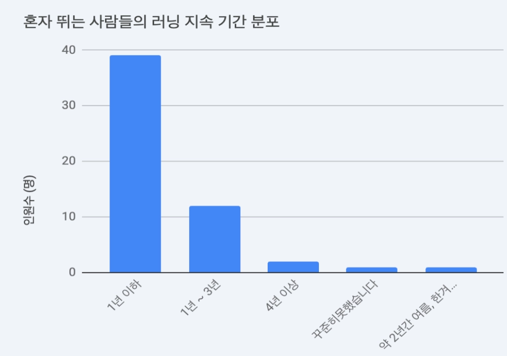
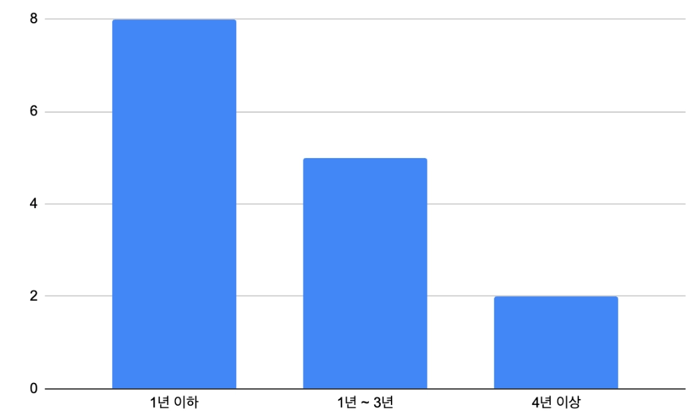

# Week 4 최종 보고서 - [런파민]

## 4주 흐름 한 줄 요약

- iOS  앱 배포, Android 앱 테스트 진행, 사용자 피드백 받기

---

## A. 처음 의도 vs 결과

### 문제 정의의 변천

| 구분 | 1주차 | 4주차 |
| :--- | :--- | :--- |
| **누가** | 건강 관리/다이어트 목적 러너 | 입문 러너 |
| **상황** | 혼자 러닝을 지속할 때 | 러닝을 지속하는 과정에서 |
| **불편함** | 동기부여 부족으로 인한 지속성 저하 | 동기부여 및 재미 요소 부족 |
### MVP 범위의 변천

| 구분 | 1주차 목표 (계획) | 실제 구현 완료 내용 |
| :--- | :--- | :--- |
| **로그인** | 애플 소셜 로그인 | 애플, 구글 소셜 로그인 및 닉네임 설정 |
| **팀 시스템** | 랜덤 팀 배정 및 랭킹/배틀 기능 | (미구현 또는 추후 예정) |
| **러닝 측정** | 거리, 페이스, 칼로리, 시간 측정 및 로컬 저장 | (미구현 또는 추후 예정) |
| **데이터** | 러닝 데이터 DB 저장 및 경로 표시 | (미구현 또는 추후 예정) |

### 기술 선택 재평가

- 다시 한다면 같은 기술? 왜?
    - 같은 기술 선택 (iOS, Android 네이티브)
        - 러닝 앱 특성 상 장시간 GPS를 사용해야 하는데,  OS 수준의 최적화 기능을 직접 활용할 수 있는 네이티브 방식이 적합하다.
- 고려했다 안 쓴 선택지와 뺀 이유:
    
    | 후보 | 검토했지만 선택하지 않은 이유 |
    | :--- | :--- |
    | **Flutter** | 네이티브 대비 앱 크기가 크고, 러닝 앱의 핵심인 백그라운드 GPS, 센서 최적화, Watch 연동 시 결국 네이티브 코드가 필요함. 빠른 화면 개발보다 MVP 핵심 기능의 안정성과 최적화가 우선순위라 제외. |
    | **React Native** | 빠른 개발이 가능하지만, 위치/센서/워치 등 복잡한 네이티브 기능 연동 시 브릿지 관리와 빌드 환경 등 안정성 측면의 유지보수 부담이 큼. |
    | **KMP / CMP** | 비즈니스 로직 공유 장점이 있으나, iOS 및 Watch 생태계의 성숙도가 네이티브에 비해 낮음. 기술 검증 비용을 최소화하고 플랫폼별 핵심 기능 구현에 집중하기 위해 제외. |

---

## B. 가설 검증 종합

| 주차 | 가설 | 결과           | 받아들인 방식                                                             |
| :--- | :--- |:-------------|:--------------------------------------------------------------------|
| 1주차 | 러닝에 팀 경쟁·랭킹 요소를 추가하면 동기부여와 지속성에 도움이 될 것이다. | 불명확          | 경쟁 강조 시 페이스 조절 등 러닝의 본질적인 즐거움을 저해할 수 있다는 의견 수렴.                     |
| 2주차 | 혼자 러닝 시 지속하기 어렵다. | 지지(그래프 1 참고) | 혼자뿐 아니라 팀 단위 러닝에서도 중도 이탈률이 존재함을 확인하여(그래프 2 참고) 추가적인 동기부여 요소 필요성 판단. |
| 3주차 | 지인 간 기록 공유 및 캐릭터 성장 요소가 흥미와 동기부여를 줄 것이다. | 불명확          | 특정 캐릭터에 대한 흥미는 확인했으나, 그것이 실제 러닝 지속으로 이어지는지는 추가 검증 필요.               |

(그래프 1: 혼자 뛰는 사람들의 러닝 지속 기간 분포)

(그래프 2: 여럿이서 뛰는 사람들의 러닝 지속 기간 분포)

### 가장 크게 깨진 가설

- 무엇이었는가:
    - 사람들은 러닝에 팀 경쟁, 랭킹 등의 요소가 추가되면, 이에 동기를 부여받고 러닝을 지속할 수 있다.
- 어떻게 받아들였는가:
    - 돈이나 포인트가 걸린 경쟁은 부담과 무리한 러닝을 유발해 오히려 부상 위험을 높힐 수도 있다. 이는 러닝의 본질적인 목적(건강 관리, 지속 가능한 운동)과 맞지 않는다.

### 끝까지 검증 못 한 가설 (있다면)

- 러닝을 하면서 캐릭터가 변화하고 그 캐릭터의 변화를 통해 러닝에 흥미와 동기부여를 느낄 수 있을까?
- 지인들과 팀을 만들어서 서로 뛴 기록을 확인하고 자극한다면 러닝에 흥미와 동기부여를 느낄 수 있을까?

→ 현재 iOS 앱은 배포를 마쳤고, Android는 테스트 과정에 있다. 주변 지인들에게 다운로드를 부탁하고, 사용을 유도하여 앱 데이터를 모으는 과정에 있다. 이 과정에서 데이터가 충분하지 않아 아직 제대로 검증 하지 못했다. (시간이 조금 더 필요하다)

### 유저에게 받은 피드백

- 지금 날씨가 너무 더워서 밖에서 뛰기 힘드니 실내 러닝 기능을 추가해주세요.
- 사진으로 기록을 남길 수 있는 기능이 있으면 더 재미있을 것 같아요.
- 뒤로 물구나무서서 달리는 캐릭터 너무 웃겨요.
- 홈 화면에 팀에 관한 정보가 많이 들어오면 좋겠어요.
- 팀원들의 주간, 월간 기록들을 볼 수 있었으면 좋겠어요.
- 도장이 무엇을 의미하는지 조금 모호하고, 불분명해 보여요.
- 닉네임, 팀 이름에 한글 초성만 하면 확인 버튼은 활성화되나, 제대로 만들어지지 않아요.
- 탭 이동 시 로딩이 너무 길어서 답답해요.
- 지금은 사람이 적어서 괜찮은데 유저가 늘어난다면 랭킹 탭에 검색 기능이 있으면 좋을 것 같아요.

### 추후 서비스 업데이트 방향

런파민의 주요 목표는 “사용자에게 동기부여를 제공하는 것” 이다.  현재는 최근 대중적으로 흥행한 “셋로그”에서 인사이트를 얻어 그러한 느낌으로 앱을 제작했지만, 이는 모든 사용자들의 니즈에는 부합하지 않을 것이라 생각한다.

떄문에, 추후 “사용자들이 원하는 기능”이 무엇인지 조사하여 이를 추가해 주어야, 사용자들의 “동기부여”에 도움이 될 것이라고 생각한다.

현재 팀 내에서 논의된 방향은 다음과 같다.

- Instagram, 설문 폼, 앱 내 기능 요청 기능을 통해 여러가지 시선의 기능 개발 요구를 보고, 선별하여 반영한다.
- 우리 팀원들도 모두 우리 앱의 주요 타겟이다. 팀원들의 시선으로 바라봐서 좋은 기능들과 여러 번 언급된 기능들을 우선적으로 개발하여 업데이트한다.